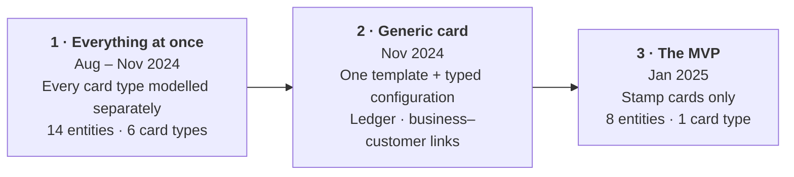
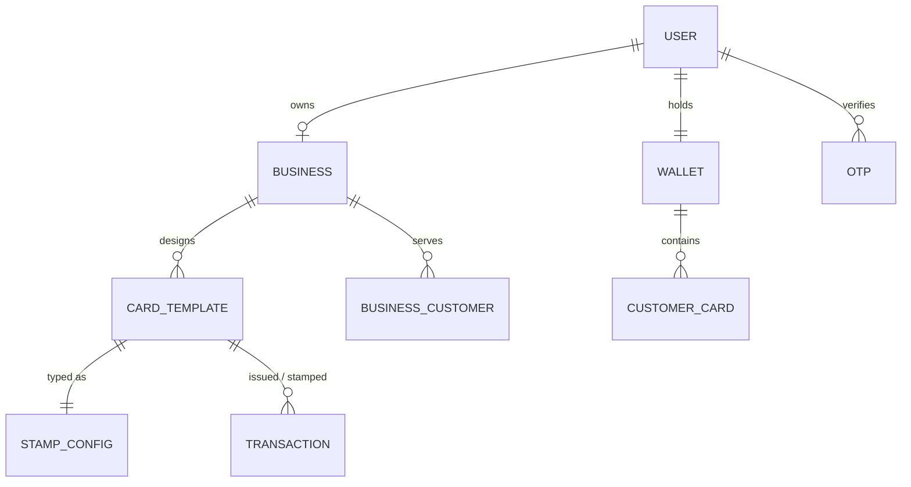
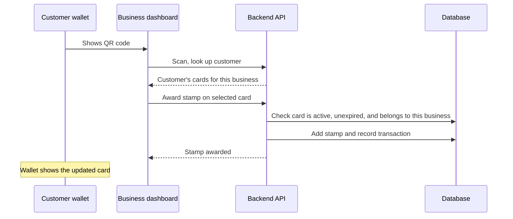
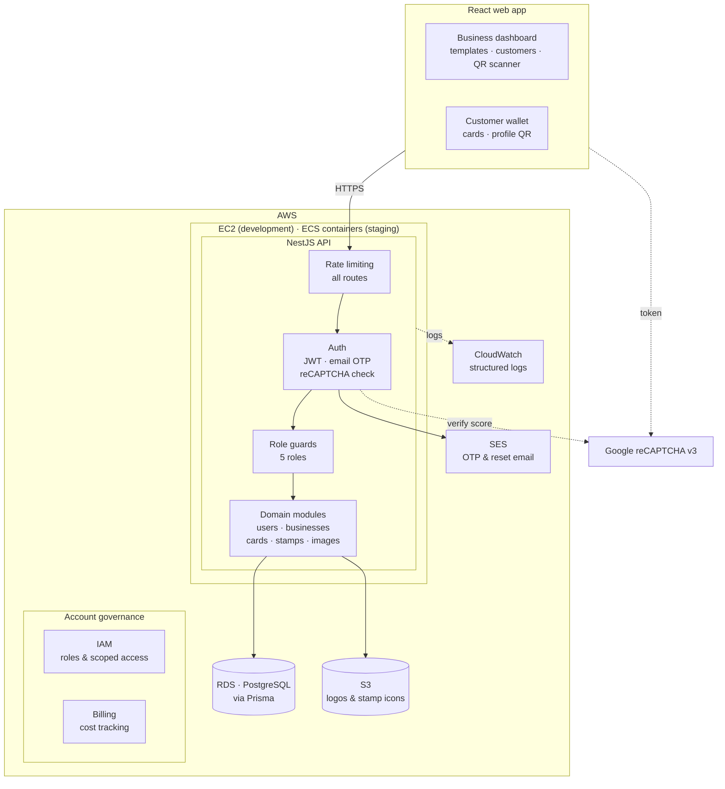

# Stamp-Card Loyalty Platform

**Product & engineering case study · Hubinit (formerly Fuuss) · 2024–2025**

> [!NOTE]
> This is a case study, not a code repository. The product code belongs to the company and is not included. It covers the problem, my role, and the design decisions at a conceptual level.

| | |
|---|---|
| **Role** | AI Engineer, Product & Backend (Early Team): product definition and backend on the loyalty platform, one of the first hires |
| **Company** | Hubinit (formerly Fuuss), early-stage startup, Netherlands (remote) |
| **Period** | August 2024 – May 2025 |
| **Product** | Digital loyalty cards for small businesses. Merchants design cards, customers carry them in a web wallet, and cards are stamped at the counter by scanning a QR code. |
| **Stack** | NestJS · TypeScript · PostgreSQL · Prisma · React · AWS (EC2, ECS, RDS, S3, SES, SNS, Cognito, CloudWatch, IAM) · Docker · GitHub Actions · Postman · Swagger |
| **Ways of working** | Agile sprints · Asana · Microsoft 365 (SharePoint, Teams) · Slack · Google Meet · Fireflies · OrangeHRM |

### What I did

- **Defined the product.** With no loyalty expertise in the company, I wrote the domain document the team built from: definitions, purpose, worked examples, and corrections to the original plan. I then scoped the MVP to stamp cards.
- **Mapped the first data model** and saw it through three iterations, from 14 entities and six card types to 8 entities and one, while keeping it extensible.
- **Built across the backend, then owned it.** I built and refactored APIs and modules, the image pipeline and S3 setup, and customer search. I also prototyped a full Amazon Cognito auth journey. When the backend lead left, I took over the whole service.
- **Led the response to a bot attack.** Investigated it, throttled the API, and coordinated bot protection across the web app and the API.
- **Shaped the team.** I recommended the developer who became backend lead, took part in daily management discussions, pushed the loyalty work into a cross-functional team, and mentored a college student joining the project, walking him through the codebase and the domain to get his career started.

### Contents

1. [The problem](#1-the-problem)
2. [Timeline](#2-timeline)
3. [Product definition](#3-product-definition)
4. [How the data model evolved](#4-how-the-data-model-evolved)
5. [The counter flow](#5-the-counter-flow)
6. [Architecture](#6-architecture)
7. [Authentication: the Cognito prototype](#7-authentication-the-cognito-prototype)
8. [Delivery](#8-delivery)
9. [Handling a bot attack](#9-handling-a-bot-attack)
10. [The wider programme](#10-the-wider-programme)
11. [Outcome](#11-outcome)
12. [Retrospective](#12-retrospective)

---

## 1. The problem

### How the project started

The company launched with three projects, each with its own team. The UI team did the company and market research and the branding, and put the project options forward, and the whole company voted on which ideas to pursue. One of the three teams never got going because its lead was unavailable, and its members were redistributed to the other two. The early team was set up as the product's definers and stakeholders, not just its builders, and the company presented it that way publicly on the page that showcased the AI employee and the loyalty product.

The loyalty project's first lead was rarely available and handed day-to-day leadership to a final-year student. Leadership changed hands several times before the first restructure settled it.

### The brief

The only brief was an existing loyalty-card product the company wanted to match: build what they do. There was no specification, and nobody in the company had worked on loyalty products, so terms like stamp card, points and redemption meant different things to different people. Early guidance amounted to "build the basic features". Frontend and backend work went ahead in parallel on different assumptions and didn't fit together.

From the first discussions, my position was that we had to build from the foundations: agree what the product is before building screens and endpoints for it. That meant answering four questions first:

- Is a "card" a template a business designs, or an instance a customer holds?
- Is the reward earned by visits, by spend, or by points, and what does each imply for the data?
- Who can award a stamp at the counter, and how is that authorised?
- What is the smallest programme a real café or salon could run on day one?

## 2. Timeline

| When | What happened |
|---|---|
| **Aug 2024** | Joined in the first cohort, contracted as AI Engineer. The company ran three projects, chosen by a company-wide vote on researched options. I was assigned to the loyalty platform. Early discussions on stack, platforms and approach. |
| **Aug – Oct 2024** | First build. I mapped the first data model from the reference product and wrote the domain document. Teams worked in parallel without a shared plan. |
| **Nov 2024** | First restructure. The model was redesigned around a generic card, and the transaction ledger and business–customer relationships came in. Agile sprints in Asana, teams by specialism, and iterative documentation on SharePoint followed. I recommended the developer who became backend lead. I was asked to take a leadership role too, and chose to stay hands-on. Towards the end of the term, I pushed for the loyalty work to run as one cross-functional team, with everyone joining design meetings and test sessions, and it did. |
| **Dec 2024 – Jan 2025** | At the end of the first term, many early contributors left together, including the backend lead and other team leads. I took over the backend. MVP scope cut to stamp cards, with unused card types and duplicate entities removed. |
| **Feb 2025** | Second term. New project owners were brought in to share coordination, though the arrangement never took hold. I asked to move to the AI team, and its lead wanted me, but I stayed on the loyalty platform because it depended on me. |
| **Mar 2025** | I led the bot-attack investigation and hardened the API. |
| **Mar – Apr 2025** | Recovered the frontend of the company's M&A valuation prototype. The technical programme director left, and day-to-day operations stalled without a handover. |
| **Spring 2025** | The company decided to restart with a new team. Existing contributors, including long-standing ones, were offboarded, and the programme ended in May. |

## 3. Product definition

### The domain document

With no one in the company who knew the domain, I wrote the reference the team built from. It defined every term (card template, card instance, stamp, reward, redemption, points, cashback, and the other card types), and explained what each was for and how it would work for a real business. It included worked examples and ideas for later phases. It also listed corrections where the existing plan misunderstood the domain. I presented it to leadership and walked the team through it.

The core of it compared the main programme types:

| Model | How it works | What it means for the build |
|---|---|---|
| Stamp / punch card | N visits or purchases → reward | A counter per customer card. Easiest for merchants to understand. |
| Points (earn & burn) | Spend converts to points, redeemed later | Needs a ledger, conversion rules, expiry, and liability tracking |
| Cashback | A percentage of spend returned as credit | Needs transaction amounts and a running balance |
| Gift card / coupon / discount | Stored value or one-off offers | Needs issuance limits, validity, and redemption tracking |
| Tiered | Status levels unlock benefits | Needs a rules engine and periodic re-evaluation |

### The scope decision

**Launch with stamp cards only.**
They're the easiest programme for a small merchant to adopt, and the smallest thing we could build end to end and put in front of real businesses.

**What stayed open:** card types and reward types remained in the design as extension points, so points or cashback could be added later without a redesign.

### What the product was defined around

- **Roles:** platform admin, customer support, business owner, business staff, and customer. The MVP ran counter actions under the business-owner account, and the separate staff role was modelled for later.
- **Core flow:** a business designs and activates a card, issues it to a customer, and awards stamps until the reward is earned.
- **Audit trail:** every card issued and every stamp awarded is recorded as a transaction. Businesses see a stamp history per customer and per card. Redemption was modelled as a transaction type ready for the next iteration. In the MVP, a completed card counted a reward earned and started over.
- **Business view:** a customer list with search, new customers over a chosen period, and each customer's cards and history.
- **Counter-friendly identity:** customers are identified by a serial number and a QR code, so a business can find them without touching account details.
- **API contracts:** documented in Swagger and agreed between the frontend and backend before implementation.

### How we worked

After the first restructure, the team moved to Agile, run on the Microsoft 365 stack alongside Slack:

| Practice | How it ran |
|---|---|
| **Sprints and task tracking** | Sprint planning, backlogs and task tracking in Asana |
| **Communication** | Microsoft Teams and Slack, set up to mirror the organisation's design, with channels per team and function. Google Meet for calls. |
| **Documentation** | Product and process documentation on SharePoint, built up in iterations sprint by sprint, including the domain document, requirements and API notes |
| **Daily rhythm** | Meetings recorded, transcribed, translated and summarised automatically with Fireflies, so the distributed team worked from the same record |
| **People operations** | OrangeHRM for time tracking, leave, performance reviews and staff records |

I encouraged the UI team to lead on design and product ideas, shaping the product from the domain document's research, definitions and recommendations rather than from backend constraints. I also pushed for every feature to start from its "why". Before anything was built, the frontend and backend leads walked through the business logic, the workflow, and the user experience together, so both sides built the same thing. Later, I pushed for everyone on the loyalty work, whatever their team, to attend the design meetings and test sessions. Anyone joining got the full view of the product, not just their slice of it.

## 4. How the data model evolved

**1 · Everything at once.** I mapped the first model from the reference product's public features, which were the only specification we had. It gave every card type its own entity: stamp, reward, cashback, gift card, coupon and discount. Each one repeated the business's details and branding fields. Customers and managers also had profile entities separate from users, and the role list had overlapping values. It mapped the domain faithfully, but it was too broad for a small, uncoordinated team to build against. It was set aside in the first restructure.

**2 · Generic card.** The backend lead's redesign replaced it with a single card template (name, branding, validity, issue limits, type) linked to a type-specific configuration. A transaction ledger and a business–customer relationship came in the same month.

**3 · The MVP.** Card types narrowed to stamp only. The unused entities were removed, and the roles were consolidated to five. The generic structure stayed, so adding points or cashback later means adding one configuration type, not a redesign.

## 5. The counter flow

This is the interaction the whole product was built around: a customer at the till, the business with a phone or tablet, and a few seconds to get it right.

Issuing a new card works the same way. The business scans the customer's profile QR (or enters their email), chooses one of its active templates, and the card appears in the customer's wallet. Email lookup is there as a fallback for when a camera or a phone isn't cooperating.

## 6. Architecture

| Area | Decision | Why |
|---|---|---|
| **Authentication** | Short-lived access tokens with refresh tokens. Email OTP for verification and password reset. | Keeps sessions revocable without forcing frequent logins |
| **OTP handling** | Codes hashed at rest, five-minute expiry, attempt limit, resend cooldown | An OTP endpoint is an obvious target for guessing and email flooding |
| **Authorisation** | Role guards on business and customer routes. Card and customer actions scoped to the requesting business. | One business must never be able to read or stamp another's cards |
| **Consistency** | Account creation, card issuing and stamping wrapped in database transactions | Avoid half-created accounts and cards |
| **Images** | Type and size validated, resized, and stored in S3 on an infrequent-access storage class | Logos and stamp icons are written once and read often, so there's no need to pay for hot storage |
| **Customer search** | Fuzzy matching with pagination, scoped to the business's own customers | People type names quickly and imperfectly at the counter |

**My part in the codebase:** the backend lead wrote most of the core APIs and led the model redesign. I built APIs alongside him and worked across the rest of the service: cleaning up and refactoring modules, building the image pipeline end to end (validation, resizing, S3 bucket setup, storage class, URL handling), reworking customer search, and hardening the API. I reviewed and discussed the rest. After he left, I owned all of it.

## 7. Authentication: the Cognito prototype

Before the JWT-based auth was settled, I built a complete sign-up and sign-in journey on Amazon Cognito, AWS's managed authentication service. It covered registration, verification, login and recovery.

I worked through both verification channels. Email verification needed a verified sending domain, which the team didn't own or control at that point, so the journey used SMS verification through AWS instead.

The prototype wasn't merged. The product already had its own JWT authentication, and switching would have meant reworking every client and guard in the middle of the MVP. The work fed directly into the auth design that stayed: separate verification and recovery flows, short-lived codes, and treating verification endpoints as abuse targets.

## 8. Delivery

- **Two environments.** Development deployed automatically to EC2 on every push. Staging ran as Docker containers on ECS through a central CI/CD pipeline, which I worked through with the DevOps team in a live session while it was being set up.
- **Versioned schema changes** through Prisma migrations, applied as part of each deploy.
- **Automated API tests** ran against the live development environment after every deploy, using a Postman suite. The backend lead built the suite, and I extended it.

## 9. Handling a bot attack

In March 2025, with the backend now mine, the platform came under automated attack just as we were getting ready to demo to waiting clients.

The MVP site had been made public, against my recommendation to keep it behind access controls until the demos, and its URL had spread beyond the intended audience. Automated scripts hammered the login endpoint and the sign-up and verification journey, overloading the service. The abuse had gone unnoticed for weeks before it was picked up. AWS suspended SMS sending on the account until the company submitted a detailed investigation report and remediation plan. The same period brought spam attempts against the company's domain and mail.

| Step | What I did |
|---|---|
| **Get access** | Server and infrastructure access sat with a separate team. Getting access to the instances and logs needed for the investigation was the first hurdle and took time. |
| **Investigate** | Analysed the database and application logs to identify the request patterns and the endpoints being hit |
| **Contain** | Added rate limiting on every API route. Unauthenticated traffic got stricter limits than signed-in customers and businesses, and every violation was logged with its request context. |
| **Verify humans** | Coordinated reCAPTCHA v3 with the frontend team. The web app's public forms issued tokens, and the API verified them against a score threshold before processing. |
| **Instrument** | Wired the backend into the CloudWatch logging DevOps had provisioned, with client errors and server errors separated, so future incidents could be surfaced |

## 10. The wider programme

The company started with three project teams. After one folded into the others and the first restructure took place, the work was organised into teams by specialism:

- **Frontend team:** the React/TypeScript web app, including the business dashboard, card template designer, QR scanning, and the customer wallet.
- **DevOps team:** AWS, the staging environment on ECS, and the central CI/CD pipeline.
- **AI team:** an "AI employee" assistant designed to give stock and investment insights, iterated several times across two platforms. One version was a Django service with real-time WebSocket chat backed by Amazon Lex V2. No frontend was built for it, and it ended as a "coming soon" page.
- **M&A valuation prototype:** a new product idea that leadership prototyped with AI coding tools, aimed at European SMB owners, with LLM-based company analysis, document review and an advisory chat (DeepSeek). Its React frontend had been generated with AI tooling and left hardcoded and not rendering. I got it rendering and working so it could be demonstrated.

## 11. Outcome

The loyalty platform was built, deployed, and publicly reachable, which is how it attracted the bot attack. Businesses were lined up and waiting for demos for months. The bot attack landed just as those demos were due, and the delay came at a time when the team was already thinning. The work of separate teams never came together into a product leadership was ready to show. Leadership turned to prototyping new product ideas directly with AI coding tools, and after a year without a launchable MVP, the company chose to restart with a new team.

What I took from it:

- Product definition and domain research with no one above me to hand me the answers.
- Ownership of a live backend through a team change and a security incident.
- Hands-on AWS across EC2, ECS, RDS, S3, SES, SNS, Cognito, CloudWatch and IAM.
- A clear view of how team structure and leadership decide whether a product ships.

## 12. Retrospective

### What worked

- **The domain document.** It gave the team shared definitions and turned a feature list into a product. The UI team used it to lead the product's design with confidence.
- **The people team.** The HR team of that period brought the organisation to life: running meetings, setting up the structure, and keeping a distributed team connected.
- **The first restructure.** Agile sprints, documentation that grew with each iteration, and frontend–backend discussions of the "why" behind each feature produced the only stretch of steady progress towards an MVP.
- **The scope cut.** Narrowing to stamp cards, on a generic model, gave the team something it could finish.
- **Going cross-functional.** Towards the end of the first term, the loyalty work ran as one team across frontend, backend and infrastructure, with shared design meetings and test sessions. Everyone got maximum exposure to the whole product, and it was the most joined-up the project ever was.

### What held the product back

- **No product leadership with domain knowledge.** The project's first lead was rarely available, and leadership passed through several hands before settling. The product definition fell to the early team, most of whom were early in their careers, with no one above them who knew loyalty products.
- **Leadership that was stretched thin.** Leadership attention was split across several ventures. Promised changes to teams and direction often arrived late or not at all, responses to the team's questions could take weeks, and tension within management went unresolved.
- **Teams organised by tech layer, for most of the programme.** Separate frontend, backend, AI and infrastructure teams worked more like departments in a large organisation than a startup. Simple requests could take days, and access to infrastructure had to be negotiated case by case.
- **Tight central control.** The structure that followed the restructures was rigid and tightly controlled from the centre. It held things together, but it overstretched the people running it and wore down the people inside it. Bringing in project owners to share the load came too late to take hold.
- **No dedicated testing or security.** Requests for a testing team and a security specialist weren't taken up. The final apps were tested by the UI team and leadership themselves.
- **Turnover without handover.** Contributors left in waves. When key people went, including the leads and the core of each team, their knowledge, accounts and tooling went with them.
- **Work that never joined up.** The AI team's iterations never got a frontend. The loyalty platform's pieces never came together into a demo.

### What I'd do differently

**Take the leadership role.** I was asked to lead as well as build, and I chose to stay hands-on. In hindsight, that was a mistake. The product needed someone who understood both the domain and the code in the room where decisions were made, and I was already doing half of that job without the authority to finish it.

In my next role, as a founding-team member at EsimTime, I took the lead: full ownership of the platform through its public launch, including preparing for the security incidents a public launch with paid ads would draw. EsimTime went on to rank in the top 5 on F6S.

**Agree the domain model before writing code.** My own first data model had the same problem as the early build in a different form: it copied the whole of an existing product instead of the MVP. I now start from the core features that support one real flow end to end, with the architecture set up to grow from there.

**Model customer cards as rows.** Customer card instances lived inside one wallet document per customer. That was quick to build, but it made per-card queries harder, and updates to the document sat partly outside the database transactions around them.

**Build security in from the start, and keep unlaunched products private.** Rate limiting, bot protection and monitoring were added after an incident. On a public platform they belong in the first release, and they need to be verified end to end, not just configured. Testing and security also need owners, not volunteers: a dedicated tester and a security specialist were requested and never hired. Until launch, a pre-release product belongs behind access controls. I recommended that at the time, and I'd push harder for it now.

**Organise around the product from day one.** I pushed the loyalty work into a cross-functional team, with shared design meetings and test sessions, and it worked. But it only arrived at the end of a series of Agile restructures. Next time I'd set it up from the start, with developers holding scoped, audited access to their own infrastructure and trusted to run their own work.

**Keep tooling and knowledge in shared hands.** Team-owned accounts and a single place for decisions and handovers, so no one person's departure takes the test suite or the operating knowledge with them.

---

Written from my own role and recollection. No proprietary code, credentials, or customer data are included.
